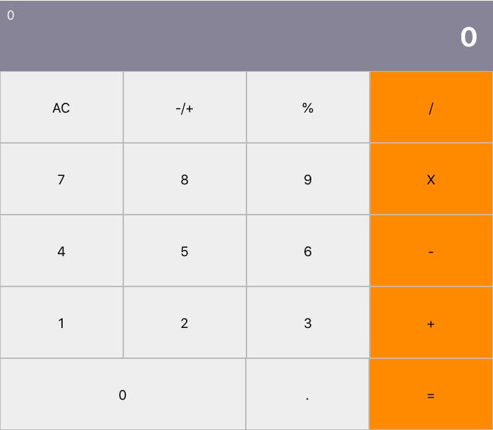

# Calculator

<!--
*** Thanks for checking out this README Template. If you have a suggestion that would
*** make this better, please fork the repo and create a pull request or simply open
*** an issue with the tag "enhancement".
*** Thanks again! Now go create something AMAZING! :D
-->

<!-- PROJECT SHIELDS -->
<!--
*** I'm using markdown "reference style" links for readability.
*** Reference links are enclosed in brackets [ ] instead of parentheses ( ).
*** See the bottom of this document for the declaration of the reference variables
*** for contributors-url, forks-url, etc. This is an optional, concise syntax you may use.
*** https://www.markdownguide.org/basic-syntax/#reference-style-links
-->

[![Contributors][contributors-shield]][contributors-url]
[![Forks][forks-shield]][forks-url]
[![Stargazers][stars-shield]][stars-url]
[![Issues][issues-shield]][issues-url]

<!-- PROJECT LOGO -->
<br />
<p align="center">
  <a href="https://github.com/ioanniskousis/Calculator">
    
  </a>
  
  <h3 align="center">The Calculator Application</h3>
  
  <p align="center">
    This project is part of the Microverse curriculum in React course!
    <br />
    <a href="https://github.com/ioanniskousis/Calculator"><strong>Explore the docs</strong></a>
    <br />
    <a href="https://calculator-jk.herokuapp.com">Live Version</a>
    <br />
    <a href="https://github.com/ioanniskousis/Calculator/issues">Report Bug</a>
    <span> - </span>
    <a href="https://github.com/ioanniskousis/Calculator/issues">Request Feature</a>
  </p>
</p>

## This is a Calculator application

<hr />

<!-- TABLE OF CONTENTS -->

## Table of Contents

- [Calculator](#calculator)
  - [This is a Calculator application](#this-is-a-calculator-application)
  - [Table of Contents](#table-of-contents)
  - [Screen Shots](#screen-shots)
  - [About The Project](#about-the-project)
  - [Application Instructions](#application-instructions)
  - [Live Version](#live-version)
  - [System Requierments](#system-requierments)
  - [Development](#development)
  - [Dependencies](#dependencies)
  - [Built With](#built-with)
  - [Contributors](#contributors)
  - [Ioannis Kousis](#ioannis-kousis)
  - [Acknowledgements](#acknowledgements)

## Screen Shots  

<hr />

<!-- ABOUT THE PROJECT -->

## About The Project  
  The project was created using the create-react-app model  
  The App functional component renders 2 elements  
    - Display, held in src/components/Display.js, responsible for the output of the calculations  
    - ButtonPanel, held in src/components/ButtonPanel.js. Contains all buttons of the calculator 

  When ButtonPanel is rendered it is passed a reference to the call back function for button click, and it passes it to each of the buttons contained in it. It is the handClick function in the App component  

  When handleClick in App component is triggered, then the calculate function is called to translate users actions and the result is assigned to the App state triggering rendering   

<hr/>

<!-- ABOUT THE PROJECT -->

## Application Instructions  
  The application performs basic functions of a calculator, paticularly, operations between two numbers   
  - The user enters the first number  
  - Then select an operation between %, /, *, -, +  
  - Next, selects the second number  
  - Clicking '=' or an operation button, provides the result to the display and expects a next number to operate on the total  

<hr/>

## Live Version

[Heroku](https://calculator-jk.herokuapp.com)

<hr/>

## System Requierments

  - JavaScript Enabled  
  - You need to Disable Cross-Origin-Restrictions from your browser if you want to open the index.html from your file system without using a server.  

<hr/>

## Development
  * Clone the project
  ```
    https://github.com/ioanniskousis/Calculator.git
    
    Use VSCode and Live Server to show index.html
    Since webpack is used, run 'npm run build' on you terminal before opening
  ``` 
<hr/>

## Dependencies

  please run
  ```
    npm run build
  ```
  to comply with the dependencies held in package.json
<hr/>

## Built With

This project was built using these technologies.

  - React  
  - Big Numbers
  - CSS3  
  - webpack  
  - Git - GitHub  
  - ESLint  
  - Stylelint  
  - heroku  

<hr/>

<!-- CONTACT -->

## Contributors

:bust_in_silhouette:
​
## Ioannis Kousis

- Github: [@ioanniskousis](https://github.com/ioanniskousis)
- Twitter: [@ioanniskousis](https://twitter.com/ioanniskousis)
- Linkedin: [Ioannis Kousis](https://www.linkedin.com/in/jgkousis)
- E-mail: jgkousis@gmail.com
​
<hr/>
<!-- ACKNOWLEDGEMENTS -->

## Acknowledgements

  - [Microverse](https://www.microverse.org/)
  - [The Odin Project](https://www.theodinproject.com/)


<!-- MARKDOWN LINKS & IMAGES -->
<!-- https://www.markdownguide.org/basic-syntax/#reference-style-links -->

[contributors-shield]: https://img.shields.io/github/contributors/ioanniskousis/Calculator.svg?style=flat-square
[contributors-url]: https://github.com/ioanniskousis/Calculator/graphs/contributors
[forks-shield]: https://img.shields.io/github/forks/ioanniskousis/Calculator.svg?style=flat-square
[forks-url]: https://github.com/ioanniskousis/Calculator/network/members
[stars-shield]: https://img.shields.io/github/stars/ioanniskousis/Calculator.svg?style=flat-square
[stars-url]: https://github.com/ioanniskousis/Calculator/stargazers
[issues-shield]: https://img.shields.io/github/issues/ioanniskousis/Calculator.svg?style=flat-square
[issues-url]: https://github.com/ioanniskousis/Calculator/issues

